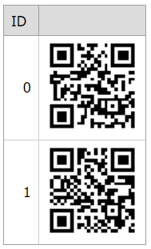

# Grid View for ASP.NET Web Forms - How to display a bar code image in a column
<!-- run online -->
**[[Run Online]](https://codecentral.devexpress.com/t280853/)**
<!-- run online end -->

This example demonstrates how to create a column's template, add a binary image control to the template, and use the **Bar Code Library** to display a bar code image.



## Overview

Specify a column's [DataItemTemplate](https://docs.devexpress.com/AspNet/DevExpress.Web.GridViewDataColumn.DataItemTemplate) property, add a binary image to the template, create a bar code, and use the image's [ContentBytes](https://docs.devexpress.com/AspNet/DevExpress.Web.ASPxBinaryImage.ContentBytes) property to display the bar code in the column.

```aspx
<dx:GridViewDataColumn>
    <DataItemTemplate>
        <dx:ASPxBinaryImage ID="BinaryImage" runat="server" OnInit="BinaryImage_Init"></dx:ASPxBinaryImage>
    </DataItemTemplate>
</dx:GridViewDataColumn>
```

```cs
namespace ASPxGridViewBarCode {
    public partial class Default : System.Web.UI.Page {
        protected void Page_Init(object sender, EventArgs e) {
            // ...
        }

        protected void BinaryImage_Init(object sender, EventArgs e) {
            var image = (ASPxBinaryImage)sender;
            var container = (GridViewDataItemTemplateContainer)image.NamingContainer;
            var value = container.Grid.GetRowValues(container.VisibleIndex, new string[] { "Text" });
            if (value != null)
                image.ContentBytes = GetBarCodeImage(value.ToString());
        }

        public byte[] GetBarCodeImage(string parameter) {
            BarCode barCode = new BarCode();
            // ...
            return ImageToByte(barCode.BarCodeImage);
        }

        public static byte[] ImageToByte(Image img) {
            ImageConverter converter = new ImageConverter();
            return (byte[])converter.ConvertTo(img, typeof(byte[]));
        }
    }
}
```

To enable this functionality, implement the [Bar Code Library](https://docs.devexpress.com/OfficeFileAPI/15094/barcode-generation-api). To use that library in your application, you need a license for the [DevExpress Office File API Subscription](https://www.devexpress.com/products/net/office-file-api/).

## Files to Review

* [Default.aspx](./CS/ASPxGridViewBarCode/Default.aspx) (VB: [Default.aspx](./VB/ASPxGridViewBarCode/Default.aspx))
* [Default.aspx.cs](./CS/ASPxGridViewBarCode/Default.aspx.cs) (VB: [Default.aspx.vb](./VB/ASPxGridViewBarCode/Default.aspx.vb))

